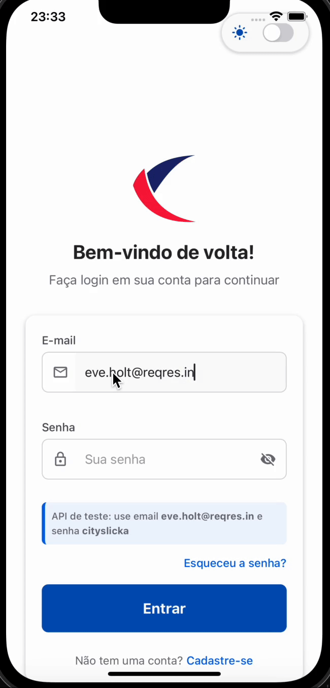

# Alleasyapp

Um aplicativo React Native com funcionalidades de autenticação, tema escuro/claro e integração com módulos nativos para obter informações do dispositivo.

## Demonstração



## Requisitos

- Node.js 20 ou superior
- Xcode 14 ou superior
- Android Studio
- CocoaPods
- JDK 11 ou superior

## Tecnologias Utilizadas

- React Native 0.75.2
- TypeScript
- Native Base (UI)
- Zustand (Gerenciamento de Estado)
- React Hook Form + Yup (Formulários e Validações)
- Axios (Requisições HTTP)
- Jest + React Testing Library (Testes)

## Instalação

Siga os passos abaixo para configurar o ambiente e executar o projeto:

```bash
# Clone o repositório
git clone https://github.com/seu-usuario/alleasy-test.git
cd alleasy-test

# Use Node.js 20
nvm use 20

# Instale as dependências
npm install

# Instale os pods (iOS)
npm run pods

# OU para uma reinstalação completa caso encontre problemas
npm run reinstall
```

## Executando o Projeto

### iOS

```bash
# Certifique-se de estar usando Node.js 20
nvm use 20

# Execute no iOS
npm run ios
```

### Android

```bash
# Certifique-se de estar usando Node.js 20
nvm use 20

# Execute no Android
npm run android
```

## Scripts Úteis

O projeto possui vários scripts personalizados para facilitar o desenvolvimento:

- `npm start` - Inicia o Metro Bundler
- `npm run ios` - Executa o app no iOS
- `npm run android` - Executa o app no Android
- `npm test` - Executa os testes unitários
- `npm run clean` - Remove node_modules e arquivos de lock
- `npm run reset` - Limpa e reinstala as dependências
- `npm run clean:ios` - Limpa os arquivos do iOS
- `npm run clean:android` - Limpa os arquivos do Android
- `npm run pods` - Instala os pods do iOS
- `npm run pods:clean` - Limpa e reinstala os pods do iOS
- `npm run reinstall` - Reinstalação completa (limpa tudo e reinstala)
- `npm run start:fresh` - Reset completo e inicia o Metro Bundler com cache limpo

## Testes

O projeto conta com testes unitários para os principais componentes e lógicas:

```bash
# Execute os testes
npm test
```

## Recursos Implementados

- Autenticação (Login/Registro) usando API de teste Reqres.in
- Sistema de tema claro/escuro
- Integração com módulos nativos (iOS e Android)
- Formulários com validação
- Componentes UI reutilizáveis
- Feedback visual para ações do usuário

## Credenciais para Testes

Para testar a autenticação com a API Reqres.in, use:

- **Login**: email: `eve.holt@reqres.in` / senha: `cityslicka`
- **Registro**: email: `eve.holt@reqres.in` / senha: `pistol`
